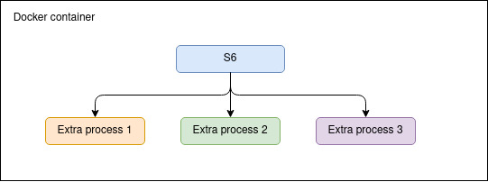

# Lab 04 - Docker

> Authors: Doran Kayoumi & Jérôme Arn
>
> Date: 6th of December 2020

## Task 0: Identify issues and install the tools

> Take a screenshot of the stats page of HAProxy at http://192.168.42.42:1936. You should see your backend nodes.


> Give the URL of your repository URL in the lab report.

[https://github.com/hans-arn/Teaching-HEIGVD-AIT-2020-Labo-Docker](https://github.com/hans-arn/Teaching-HEIGVD-AIT-2020-Labo-Docker)

## Task 1: Add a process supervisor to run several processes

> Take a screenshot of the stats page of HAProxy at http://192.168.42.42:1936. You should see your backend nodes. It should be really similar to the screenshot of the previous task.


> Describe your difficulties for this task and your understanding of what is happening during this task. Explain in your own words why are we installing a process supervisor. Do not hesitate to do more research and to find more articles on that topic to illustrate the problem.



> Note: In this simple diagram, we can see that `S6` is the main process of the container and that it has 3 children (i.e. 3 extra processes are executed)

## Task 2: Add a tool to manage membership in the web server cluster

> Provide the docker log output for each of the containers: `ha`, `s1` and `s2`. You need to create a folder `logs` in your repository to store the files separately from the lab report. For each lab task create a folder and name it using the task number. No need to create a folder when there are no logs.

You can See in file **ROOT/logs/task2/** for the different logs.

> Give the answer to the question about the existing problem with the current solution.

The main problem is that the service `serf` on our HA Proxy, doesn't know what to do with the newbie of the cluster. Some scripts are missing to have a working system. 


In fact we can see in the logs that we have an event  **member-join** but the relative script **member-join.sh** is missing (as we can see below). And with no behavior on a **member-join**, the Ha proxy doesn't send an acks to new member.  The Attempt to connect, block the Ha proxy and it cause a timeout error for the following error. 

```sh
2020/12/02 16:41:52 [INFO] agent: Received event: member-join
2020/12/02 16:41:52 [ERR] agent: Error invoking script '/serf-handlers/member-join.sh': exit status 127
```

> Give an explanation on how `Serf` is working. Read the official website to get more details about the `GOSSIP` protocol used in `Serf`. Try to find other solutions that can be used to solve similar situations where we need some auto-discovery mechanism.

Serf Maintains a cluster of memberships lists, for a load balancer in our case, each time a node comes online or goes offline serf notify the load balancer. It work with the Gossip protocol.

Gossip protocol is used to broadcast messages to the cluster in bidirectional mode. It's a peer-to-peer protocol that spread between machine on the cluster. It avoids single point of failure. 

It means that the nodes will keep updated about the status of other nodes. When a new node join the cluster, it will be added to the list and her health will be checked by the other nodes.

About some other solutions we can see on this page  [Here]: https://www.serf.io/intro/vs-zookeeper.html

## Task 3: React to membership changes

> Provide the docker log output for each of the containers:  `ha`, `s1` and `s2`. Put your logs in the `logs` directory you created in the previous task.


> Provide the docker log output for each of the containers:  `ha`, `s1` and `s2`. Put your logs in the `logs` directory you created in the previous task.

## Task 4: Use a template engine to easily generate configuration files

> You probably noticed when we added `xz-utils`, we have to rebuild the whole image which took some time. What can we do to mitigate that? Take a look at the Docker documentation on [image layers](https://docs.docker.com/engine/userguide/storagedriver/imagesandcontainers/#images-and-layers). Tell us about the pros and cons to merge as much as possible of the command. In other words, compare:
>
> ```
> RUN command 1
> RUN command 2
> RUN command 3
> ```
>
> vs.
>
> ```
> RUN command 1 && command 2 && command 3
> ```

Docker images are built from a series of layer and each of them, represent a line in the Dockerfile and each layer will impact the size of the image.  So to reduce the size, we can simply change this

```
RUN command 1
RUN command 2
RUN command 3
```

to this

```
RUN command 1 && command 2 && command 3
```

However, this does come with a drawback. For instance, if we need to add a new library (i.e. add another command), Docker will have to rebuild the entire image. This is because Docker doesn't rebuild layers that it already built (it uses a cache to know which layer it already build). 

> There are also some articles about techniques to reduce the image size. Try to find them. They are talking about `squashing` or `flattening` images.

The idea behind squashing a Docker **image** is to create a new image with fewer and smaller layers. There are tools such as [docker-squash](https://github.com/jwilder/docker-squash) and the **experimental** option [--squash](https://docs.docker.com/engine/reference/commandline/build/#squash-an-images-layers---squash-experimental) offered by Docker to squash images.

On other solution, would be to `flatten` a Docker **container**. All we need to do, is to start a container then export and import said container to create a new image that will only contain one layer.

```bash
docker export <container> | docker import - img_size_optim_flatten:latest
```

> Sources:
>
> * [phoenixnap.com](https://phoenixnap.com/kb/docker-image-size)
>
> * [hackermoon.com](https://hackernoon.com/tips-to-reduce-docker-image-sizes-876095da3b34)

> Propose a different approach to architecture our images to be able to reuse as much as possible what we have done. Your proposition should also try to avoid as much as possible repetitions between your images.

What we can do, is to create a base image that contains all the common tasks used in our architecture. This will ensure that we only build these task once. Afterwards, we can simply use Dockers `FROM` instruction to "include" the base image into other images that need them.

> Provide the `/tmp/haproxy.cfg` file generated in the `ha` container after each step.  Place the output into the `logs` folder like you already did for the Docker logs in the previous tasks. Three files are expected.
>
> In addition, provide a log file containing the output of the `docker ps` console and another file (per container) with `docker inspect <container>`. Four files are expected.

All of the logs can be found in [Task 4](logs/task4). The generated `haproxy.cfg` after each steps are stored in [haprocy.cfg](logs/task4/haproxy.cfg) folder. And finally, the logs for `docker ps` and `docker inspect <container>` are stored in the root of [Task 4](logs/task4).

> Based on the three output files you have collected, what can you say about the way we generate it? What is the problem if any?

Docker inspect generates a JSON array containing detailed informations on Docker objects (i.e. containers, images). The problem with the JSON, is that it contains **every** single bit of information about the object and that most of it either has it's default value and/or is set to `null`. This makes quit big and therefore, hard to read.

BUT, `docker inspect` offers the `--format` option so we can format the output using a `Go` template so we only see the information we want and hence, solves the readability issue.

e.g. 

```bash
$ docker inspect --format='{{json .NetworkSettings.Networks}}' ha
{
   "heig":{
      "IPAMConfig":{
         "IPv4Address":"192.168.42.42"
      },
      "Links":null,
      "Aliases":[
         "haproxy",
         "dd07f6441b72"
      ],
      "NetworkID":"4285b0a933bacac9b472e700a3101c350713f55122e70415b999419e10b4afb8",
      "EndpointID":"1453b72988c8809731ff14b2d6f1d7d3e603dc90301613562e58463ac9d2b32b",
      "Gateway":"192.168.42.1",
      "IPAddress":"192.168.42.42",
      "IPPrefixLen":24,
      "IPv6Gateway":"",
      "GlobalIPv6Address":"",
      "GlobalIPv6PrefixLen":0,
      "MacAddress":"02:42:c0:a8:2a:2a",
      "DriverOpts":null
   }
}
```

> Note: We've formatted the output so it's more readable :smile:

## Task 5: Generate a new load balancer configuration when membership changes

> Provide the file `/usr/local/etc/haproxy/haproxy.cfg` generated in the `ha` container after each step. Three files are expected.
>
> In addition, provide a log file containing the output of the `docker ps` console and another file (per container) with `docker inspect <container>`. Four files are expected.


> Provide the list of files from the `/nodes` folder inside the `ha` container. One file expected with the command output.


> Provide the configuration file after you stopped one container and the list of nodes present in the `/nodes` folder. One file expected with the command output. Two files are expected.
>
> In addition, provide a log file containing the output of the `docker ps` console. One file expected.


> (Optional:) Propose a different approach to manage the list of backend nodes. You do not need to implement it. You can also propose your own tools or the ones you discovered online. In that case, do not forget to cite your references.


## Task 6: Make the load balancer automatically reload the new configuration

> Take a screenshots of the HAProxy stat page showing more than 2 web applications running. Additional screenshots are welcome to see a sequence of experimentation like shutting down a node and starting more nodes.
>
> Also provide the output of `docker ps` in a log file. At least one file is expected. You can provide one output per step of your experimentation according to your screenshots.


> Give your own feelings about the final solution. Propose improvements or ways to do the things differently. If any, provide references to your readings for the improvements.


> (Optional:) Present a live demo where you add and remove a backend container.