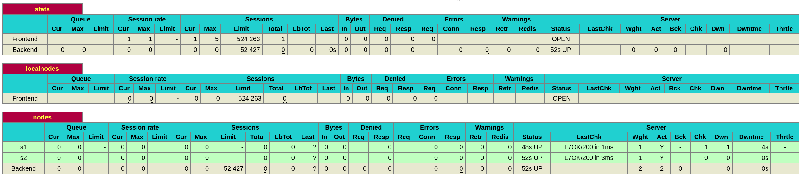
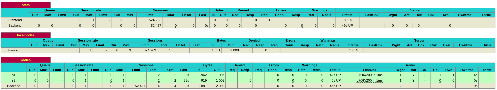

# Report 

> Authors: Doran Kayoumi & Jérôme Arn

## Task 0: Identify issues and install the tools

> Take a screenshot of the stats page of HAProxy at http://192.168.42.42:1936. You should see your backend nodes.

> Give the URL of your repository URL in the lab report.

[https://github.com/hans-arn/Teaching-HEIGVD-AIT-2020-Labo-Docker](https://github.com/hans-arn/Teaching-HEIGVD-AIT-2020-Labo-Docker)

## Task 1: Add a process supervisor to run several processes

> Take a screenshot of the stats page of HAProxy at http://192.168.42.42:1936. You should see your backend nodes. It should be really similar to the screenshot of the previous task.

> Describe your difficulties for this task and your understanding of what is happening during this task. Explain in your own words why are we installing a process supervisor. Do not hesitate to do more research and to find more articles on that topic to illustrate the problem.

## Task 2: Add a tool to manage membership in the web server cluster

> Provide the docker log output for each of the containers: `ha`, `s1` and `s2`. You need to create a folder `logs` in your repository to store the files separately from the lab report. For each lab task create a folder and name it using the task number. No need to create a folder when there are no logs.

> Give the answer to the question about the existing problem with the current solution.

> Give an explanation on how `Serf` is working. Read the official website to get more details about the `GOSSIP` protocol used in `Serf`. Try to find other solutions that can be used to solve similar situations where we need some auto-discovery mechanism.

## Task 3: React to membership changes

> Provide the docker log output for each of the containers:  `ha`, `s1` and `s2`. Put your logs in the `logs` directory you created in the previous task.

> Provide the docker log output for each of the containers:  `ha`, `s1` and `s2`. Put your logs in the `logs` directory you created in the previous task.

## Task 4: Use a template engine to easily generate configuration files

> You probably noticed when we added `xz-utils`, we have to rebuild the whole image which took some time. What can we do to mitigate that? Take a look at the Docker documentation on [image layers](https://docs.docker.com/engine/userguide/storagedriver/imagesandcontainers/#images-and-layers). Tell us about the pros and cons to merge as much as possible of the command. In other words, compare:

> Propose a different approach to architecture our images to be able to reuse as much as possible what we have done. Your proposition should also try to avoid as much as possible repetitions between your images.

> Provide the `/tmp/haproxy.cfg` file generated in the `ha` container after each step.  Place the output into the `logs` folder like you already did for the Docker logs in the previous tasks. Three files are expected.
>
> In addition, provide a log file containing the output of the `docker ps` console and another file (per container) with `docker inspect <container>`. Four files are expected.

> Based on the three output files you have collected, what can you say about the way we generate it? What is the problem if any?

## Task 5: Generate a new load balancer configuration when membership changes

> Provide the file `/usr/local/etc/haproxy/haproxy.cfg` generated in the `ha` container after each step. Three files are expected.
>
> In addition, provide a log file containing the output of the `docker ps` console and another file (per container) with `docker inspect <container>`. Four files are expected.

> Provide the list of files from the `/nodes` folder inside the `ha` container. One file expected with the command output.

> Provide the configuration file after you stopped one container and the list of nodes present in the `/nodes` folder. One file expected with the command output. Two files are expected.
>
> In addition, provide a log file containing the output of the `docker ps` console. One file expected.

> (Optional:) Propose a different approach to manage the list of backend nodes. You do not need to implement it. You can also propose your own tools or the ones you discovered online. In that case, do not forget to cite your references.

## Task 6: Make the load balancer automatically reload the new configuration

> Take a screenshots of the HAProxy stat page showing more than 2 web applications running. Additional screenshots are welcome to see a sequence of experimentation like shutting down a node and starting more nodes.
>
> Also provide the output of `docker ps` in a log file. At least one file is expected. You can provide one output per step of your experimentation according to your screenshots.

> Give your own feelings about the final solution. Propose improvements or ways to do the things differently. If any, provide references to your readings for the improvements.

> (Optional:) Present a live demo where you add and remove a backend container.